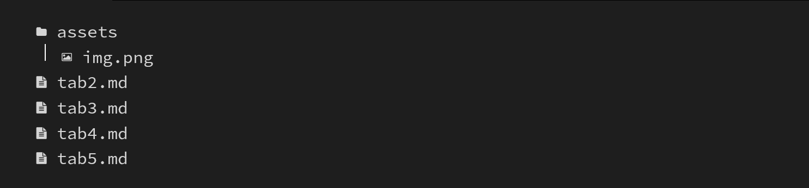
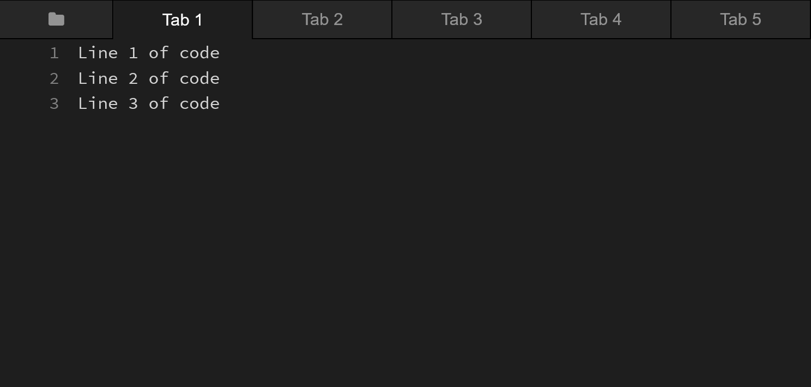

# sun-html
</img>
Inspired by the best code documentation/tutorial website I've ever found: sunjay.dev's rust game programming website.
<br>https://sunjay.dev/learn-game-dev/intro.html
# Inspiration
"code is the best documentation --you know
why? Because it never gets outdated
right and you know why it never gets
outdated because if it gets outdated
it's not compilable anymore!" <br>
--Tsoding <br>
https://www.youtube.com/watch?v=yBIgzthMEWI. <br>
We all start out not knowing how to code. Most beginners start learning to code by following video tutorials and eventually reading documentation.<br>
But what if something isn't documented? <br>
You hit a skill wall. <br>
#### This attempts to be the skill ladder to climb the wall
Most documentation provide snippets of code out of context, (Including this README.md file tbh) which makes contextualizing the snippets much more difficult.
Documentation should actively reference the code side by side! Take the copy & paste loop for instance. You copy the code and paste it ... where? well you have to think about it. It is better to run a working copy of the code than to understand it first!
### The documentation is the code!
It helps smooth the learning curve Video tutorials -> Documentation -> Reading code!

# How to use it?
Copy & Paste || Download three files sun.html, sun.css, sun.js <br>
sun.css and sun.js makes things look nice / functional. <br>
Super simple, just edit the html. <br>
## Things you might want to start with
1. Add href to Table of contents.
<pre>
&lt;nav class="toc ToggleTOC"&gt;
    &lt;ol&gt;
        &lt;li&gt;&lt;a href="#INSERTLINK"&gt;Introduction&lt;/a&gt;&lt;/li&gt;
    &lt;/ol&gt;
&lt;/nav&gt;
</pre>
2. Edit Main Text
```
<article>
  <h1>Type Anything</h1>
</article>
```
3. Tabs.
Editing Tabs is harder than the rest. <br>
I made three notes in sun.html:
- Tab selector
</img>
- FileTree
</img>
- Tab content
</img>

### Tab Selector
To hide a tab, add class="hidden" -case-sensitive btw so not "Hidden" (Ex. hide Tab 5)
```
<ul class="tab-selector">
  ...
  <li class="hidden" targetName="Tab 5">
    Tab 5
    <button class="close"><i class="fa fa-times"></i></button>
  </li>
</ul>
```
### FileTree
The FileTree is the folder icon / first tab to the left. TargetName links to Tab (Ex. "Tab 5")
```
<li TargetName="Tab X"> //X=1,2,5...N
// File/Folder Icon <i class="fa fa-file-text"></i>
// Filetree name
</li>
```

### Tab Content
```
<section class="" targetName="Tab 1">
== Insert Content Below! ==
<pre>
<code>Line 1 of code</code>
<code>Line 2 of code</code>
<code>Line 3 of code</code></pre>
</section>
```
4. Adding code content.
To add code content, you have to have a 1. code file ready, 2. format it using a generator.<br>
Which leads us to... TODO: Make a code file generator.

## FAQ: Why write in html when a static site generators like jekyll or hugo do this for you?
Yes, if you know jekyll or hugo you can use them. In my opinion, nothing can get more simple than vanilla html css and js.
In my opinion, static site generators things that you have to learn the tools to do the thing you originally wanted. You have to install extra stuff, like ruby or go. You have to know cli to run a debug server then learn the commands for the build server, and then find out the build looks different from debug.
One of the reasons why there are less documentation / guided tutorials is because of the web developer complexity syndrome.
